# Variabilité lexicale et thématique dans des poèmes générés par ChatGPT: Analyse sur différents niveau de prompting

## Résumé 

Pour ce travail de recherche, nous avons souhaité explorer la question de l’écriture créative produite par ChatGPT. En partant de l’hypothèse combinée que 1) L’écriture créative repose pour beaucoup sur la non-régularité et sur un usage non conventionnel de la langue, et que 2) le modèle de langage étant basé sur des régularités statistiques, celui-ci produirait des textes avec une variabilité lexicale et thématique relativement faible, nous avons conduit une recherche à partir de poèmes générés sur ChatGPT. Pour tester notre hypothèse, nous avons testé différents types de prompting, répartis sur trois différents niveaux de complexité. Nous avons ensuite conduit des analyses statistiques sur les poèmes issus de ces trois niveaux de prompting, en nous basant notamment sur des indicateurs de richesse lexicale, comme le MTLD, le HD-D et l’indice de diversité lexicale de Maas. Puis, nous avons également réalisé une analyse qualitative de certains poèmes générés, dans le but d’évaluer les caractéristiques tangibles d’écritures de ChatGPT et de tester nos intuitions. Finalement, nous avons fait passer un questionnaire, sous la forme d’un faux test de Turing conçu pour évaluer dans quelle mesure les poèmes semblaient avoir été écrits par un humain ou par une machine. Ceci nous a permis d’une part, de faire évaluer la qualité des poèmes par un « œil externe » mais également d’étudier les critères avancés pour justifier l’humanité ou l’artificialité, et ainsi, de nous renseigner sur la perception de l’humanité dans le langage.

## Introduction 

La question de la créativité, ou de la génération de contenu créatif, de la part des _Large Language Models_ (LLM) est sans conteste l’une des plus complexe, tant à appréhender conceptuellement, qu’à évaluer pratiquement. En effet, la question « un modèle de langage génératif peut-il être créatif ? », posée comme telle, est trop ambiguë. Le statut, ou la nature, de la créativité devraient être définis au préalable pour permettre tout élaboration d’une réponse satisfaisante. En premier lieu, la créativité peut s’entendre au sens formel ; est-il possible pour une machine de créer une nouvelle phrase, jamais énoncée ? À cette question, la réponse est de toute évidence « oui » ; les LLM, entrainés sur une large base de données textuelles, sont capables de produire des nouvelles phrases. Toutefois, la créativité s’entend également au niveau sémantique. C’est d’ailleurs en ce second sens qu’on la conçoit généralement. La créativité est « faculté d’invention ». L’interrogation apparait d’elle-même : ces modèles de langage, entrainés sur des données _existantes_, sont-ils capables de produire du contenu nouveau, innovant ? Ne sont-ils pas voués à ne sortir qu’un ramassis du passé, que des « variations sur le même thème » ? À cela, on rétorque alors aisément que rien ne nous prouve que cela n’est pas notre cas aussi, et que toute chose nouvelle que nous, humains, produisons n’est peut-être, elle aussi, qu’un ramassis de nos expériences passées. 

Ainsi, face à cette impasse argumentative, nous nous proposons de laisser de côté cette question au profit d’une autre : « Qu’obtient-on lorsque l’on demande à des LLM de générer des textes créatifs ? ». De cette manière, nous sortons d’une dichotomie de type test de Turing. Nous nous proposons en effet de remplacer la question fermée « est-ce que oui ou non les LLM peuvent produire des textes créatifs ? » par une **analyse empirique et exploratoire** des textes générés, qui nous parait plus pertinente, et surtout plus à même de livrer des résultats dignes d’intérêt.

### Hypothèses 

Nous faisons l’hypothèse que si ces modèles sont capables de générer des textes crédibles, qui « auraient pu être écrits par des humains », ou qui en sont pour le moins difficilement différentiable, ceux-ci – parce qu’ils sont entrainés à imiter des régularités – font montre d’une diversité lexicale et thématique plus faibles que des textes écrits par des humains. 

La diversité lexicale et thématique étant des mesures quantifiables, nous allons les utiliser comme des indices de mesure de la qualité créative des textes. Toutefois, nous n’avons pas la prétention d’affirmer que ces indices constituent une mesure de phénomène créatif en tant que tel, mais simplement qu’ils peuvent en constituer un _ersatz_, en donnant certains indicateurs permettant ensuite pour ainsi dire, d’ouvrir la discussion sur le sujet. 

En outre, nous nous cantonnerons pour notre étude à l’analyse de poèmes générés par ChatGPT ; un choix méthodologique qu’il s’agit pour nous de justifier.

En effet, nous faisons le parti pris de considérer des poèmes comme porte-paroles de l’écriture créative, et ce pour plusieurs raisons. En premier lieu, et il s’agit d’une raison triviale, la poésie nous apparait comme l’exemple paradigmatique de l’écriture créative, en ce qu’elle constitue la forme littéraire « artistique » par excellence, dévouée purement à l’évocation et à l’expression de la langue. Une deuxième raison, bien plus pragmatique cette fois-ci, est la longueur relativement restreinte des textes concernés. Celle-ci les rend, d’une part, plus appréhendables, plus rapides à analyser en termes de traitement des données, et d’autre part d’une longueur comparable, ce qui facilite grandement l’analyse quantitative et qualitative que l’on peut en faire. En outre, la poésie en tant qu’elle est écriture créative est jeu avec le langage, mais aussi jeu _avec les règles_ du langage. La poésie est un lieu d’expérimentation et d’innovation verbale. Et c’est justement cette expérimentation, ce « sortir des sentiers battus » que l’on peine à penser pouvoir trouver dans un algorithme, entrainé au contraire à repérer des _régularités_.

De plus, il nous faut également mentionner l’importante restriction de notre recherche de ne traiter que de poèmes générés par la version gratuite, soit 3.5, de ChatGPT. Nous reconnaissons qu’une telle limitation pourrait introduire de potentiels biais dans les résultats de notre recherche. En effet, en se basant exclusivement sur les sorties de ChatGPT 3.5, il est possible que nous reflétions les tendances, les styles et les schémas de génération spécifiques à ce modèle particulier, dont certaines pourraient être évitées ou modifiées par des modèles qui pourraient être soit plus performants – en considérant par exemple d’éventuelles améliorations ou changements dans les versions ultérieures – soit entrainés spécifiquement à la création de poésie. Ainsi, la qualité d’un poème généré par ChatGPT 3.5, n’est pas un gage de la qualité de tous les poèmes qu’il serait possible de générer avec des LLM. Toutefois, nous estimons que l’exploration de ce modèle peut nous fournir des outils et des pistes de réflexions pertinente sur le fonctionnement général des LLM ainsi que leur application dans le contexte poétique.

### Objectif de la recherche

Dès lors, l’objectif de notre recherche est d’une part, d’observer si les poèmes générés par ChatGPT 3.5 font montre d’une diversité lexicale et thématique inférieure à des poèmes humains, et d’autre part, d’analyser qualitativement ces poèmes dans le but d’explorer les mécanismes de « création » de ChatGPT. Pour ce faire, nous souhaitons comparer des poèmes générés par le modèle de langage avec des poèmes humains issus de la littérature canonique et tester les limites de ChatGPT 3.5, en comparant également les performances du modèle pour différents types de prompting.

## Données

Notre dataset est constitué de 200 poèmes, divisés en 4 groupes de 50. 1 groupe de poèmes humains, et 3 groupes de poèmes générés par ChatGPT.

En premier lieu, avons sélectionné **50 poèmes de la littérature "canonique"**. Les poèmes ont été écrits par les auteurs suivants: André Breton, Arthur Rimbaud, Alphonse de Lamartine, Alfred de Vigny, Charles Baudelaire, Guillaume Apollinaire, Gérard de Nerval, Jean Racine, Pierre Corneille, Pierre de Ronsard, Paul Verlaine, Stéphane Mallarmé, Tristan Tzara, Victor Hugo. 

Puis, nous avons généré des poèmes avec ChatGPT [préciser version]. Nous avons testé 3 différents niveaux de prompting (pour plus sur le prompt engineering, voir par exemple https://github.com/dair-ai/Prompt-Engineering-Guide/blob/main/guides/prompts-chatgpt.md). 

Pour le **premier niveau de prompting**, nous avons donné des indications minimales. Pour chaque poème de notre dataset de "poèmes humains", nous avons généré un poème en indicant le type de poème (sonnet, poème en écriture automatique, etc.) et le style de l'auteur.
- Ex : Écris un sonnet dans le style d'Arthur Rimbaud

Pour le **deuxième niveau de prompting**, nous avons donné un example à imiter. Nous avons pris chaque poème de notre dataset de "poèmes humains" et demandé à ChatGPT de générer un poème ressemblant à celui-ci. 

- Ex : Écris un poème qui ressemble à celui-ci : 
    Napoléon mourant vit une Tête armée… 
    Il pensait à son fils déjà faible et souffrant :
    La Tête, c’était donc sa France bien-aimée,
    Décapitée aux pieds du César expirant.

    Dieu, qui jugeait cet homme et cette renommée,
    Appela Jésus-Christ ; mais l’abîme s’ouvrant,
    Ne rendit qu’un vain souffle, un spectre de fumée :
    Le Demi-Dieu, vaincu, se releva plus grand.
    
    Alors on vit sortir du fond du purgatoire
    Un jeune homme inondé des pleurs de la Victoire,
    Qui tendit sa main pure au monarque des cieux ;

    Frappés au flanc tous deux par un double mystère,
    L’un répandait son sang pour féconder la Terre,
    L’autre versait au ciel la semence des dieux !
 
 
 
 Pour le **troisième niveau de prompting**, nous avons donné des indications pour "reproduire" le poème. Nous avons indiqué le début du poème, la forme, les thèmes, les champs lexicaux, et le style général. 
- Ex: 12.	Voici des instructions pour écrire un poème : 
    - Commence par « Esprit parisien ! démon du Bas-Empire !
      Vieux sophiste épuisé qui boit, toutes les nuits, »
    - Respecte la forme sonnet (deux quatrains et deux tersets)
    - Ecris un poème qui parle de l’Esprit parisien en le personnifiant. Prends un ton cynique et ironique pour faire une critique sociale
    - Met en lumière l’hypocrisie, la cruauté et la superficialité de l’Esprit parisien 

## Méthodes 

Dans cette section, nous allons décrire brièvement notre méthode de travail. 

**Preprocessing**

Pour mener à bien notre analyse, nous avons suivi un processus de prétraitement des données afin de garantir leur cohérence et leur comparabilité. Voici les étapes que nous avons suivies :
- Importation des Poèmes dans une DataFrame pandas : Nous avons rassemblé un ensemble de 200 poèmes humains et leurs équivalents générés par ChatGPT, selon les 3 niveaux de prompting mentionnés précédemment. Pour faciliter la correspondance ultérieure, nous avons conservé le nom de chaque fichier associé à son contenu.

- Séquençage du Texte : Nous avons commencé par éliminer les marqueurs de saut de ligne ('\n') pour assurer une représentation continue du texte. Ensuite, nous avons utilisé la bibliothèque NLTK pour effectuer la tokenisation des poèmes, tout en supprimant les mots vides (stopwords) en utilisant la liste des stopwords français fournie par NLTK.


#### Variabilité lexicale : fréquence des mots
L'analyse de la variabilité lexicale a été réalisée en utilisant la librairie LexicalRichness, dont la documentation est disponible à l'adresse suivante : https://github.com/LSYS/LexicalRichness/blob/master/README.rst. Les étapes que nous avons suivies sont les suivantes :
- Calcul des métriques lexicales : Nous avons calculé plusieurs métriques, notamment le nombre total de mots, le nombre de mots uniques (termes), et le ratio mots/termes, en utilisant à la fois notre propre tokenisation et celle proposée par LexicalRichness.
- Distribution des mots : Nous avons examiné la distribution des mots en fonction de leur fréquence pour chaque niveau de prompt (humain et ChatGPT).
- Mots les plus fréquents : Nous avons extrait les mots les plus fréquents pour chaque niveau de prompt, ce qui nous a permis d'obtenir un aperçu des termes prédominants dans chaque groupe.

- Indices de richesse lexicale : Nous avons calculé plusieurs indices de richesse lexicale, notamment le "Measure of Textual Lexical Diversity" (MTLD), la mesure "Hypergeometric distribution diversity" (HD-D), ainsi que la mesure de diversité lexicale de Maas.

- Analyse de ces indices en mesurant la déviation par rapport au groupe de contrôle (poèmes humains). En effet, chaque poème humain de notre dataset ayant servi de base pour un et un seul poème pour chacun des trois niveaux de prompting, les poèmes sont donc « regroupables » (_matching_) ; à chaque poème humain, correspond un poème de niveau 1, un poème de niveau 2 et un poème de niveau 3. Dès lors, nous avons calculé, pour chaque indice de richesse lexicale mentionné plus haut, la différence, pour chaque poème généré par ChatGPT avec son correspondant dans le groupe de contrôle (poème humain).

#### Variabilité thématique : Topic Modelling
Pour analyser la variabilité thématique des poèmes, nous avons adopté une approche de "Topic Modelling" en utilisant le modèle Latent Dirichlet Allocation (LDA). Voici les étapes que nous avons suivies :
- Préparation des données pour le LDA : Nous avons regroupé l'ensemble des poèmes de chaque groupe (humain et ChatGPT) en un seul texte afin de former un corpus distinct pour chaque groupe.
- Application du modèle LDA : Nous avons utilisé la bibliothèque Gensim pour exécuter le modèle LDA. Pour simplifier notre analyse, nous avons fixé le nombre de thèmes (topics) à retourner à 10. Nous avons comparé les thèmes obtenus dans l'espoir d'identifier la diversité ou la redondance des thèmes, ce qui pourrait servir d'indicateur de la diversité thématique des poèmes.
  
#### Analyse qualitative
En complément de nos analyses quantitatives, nous avons également mené une analyse qualitative approfondie des poèmes générés par ChatGPT et des poèmes humains. Cette analyse nous a permis de capturer des éléments tels que le style, l'émotion, les métaphores et les thèmes sous-jacents présents dans les poèmes. Cette approche qualitative nous a fourni un aperçu holistique et nuancé de la nature des textes produits par les deux groupes.

# Résultats 

## 1. Variabilité lexicale 

Comme l’on peut le voir dans le graphique ci-dessous, les poèmes générés par ChatGPT contiennent plus de mots fréquemment utilisés que les poèmes humains de notre dataset. On voit en effet que dans l’ensemble des poèmes humain, il n’y a que trois mots qui apparaissent plus de 20 fois, sans compter les mots « vides » (_stopwords_) supprimés lors du pre-processing, alors que les trois niveaux de poèmes ChatGPT en ont bien plus. D’une manière générale, la queue (_tail_) de la distribution de la fréquence de mots apparait comme plus épaisse pour les poèmes générés par ChatGPT. 

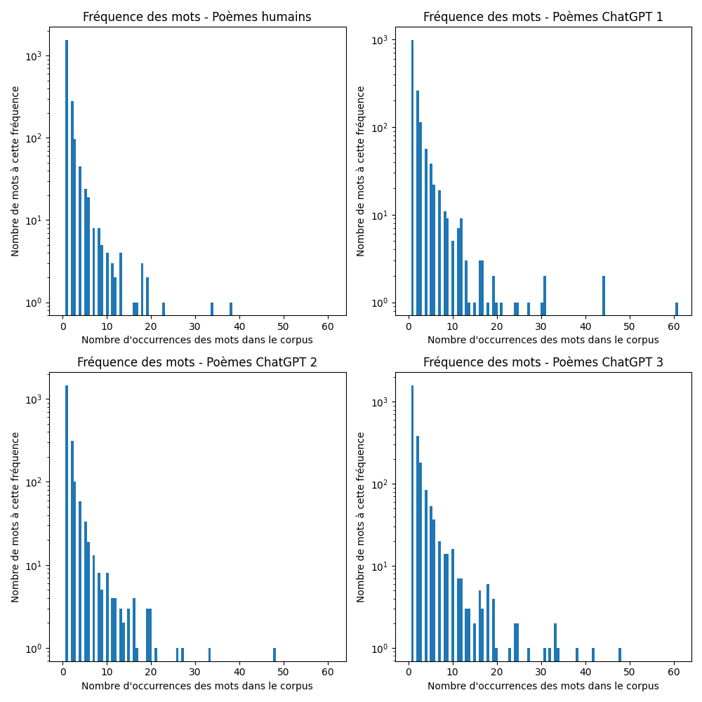

Le corpus de poèmes humains contient 10 mots présents plus de 15 fois. Ces mots sont : « quand », « a », « sous », « où », « si », « comme », « tout », « bien », et « plus ».
Le corpus de poèmes de niveau 1 contient 21 mots présents plus de 15 fois. Ces mots sont : « ciel », « nuit », « beauté », « sans », « étoiles », « pensées », « sens », « vers », « comme », « vie », « où », « monde », « l’amour », « cœur », « temps », « mots », « vent », « tout », « a », « d’un », et « ô ».

Le corpus de poèmes de niveau 2 contient 19 mots présents plus de 15 fois. Ces mots sont : « nuit », « vent », « sous », « soleil », « monde », « vie », « a », « yeux », « jamais », « où », « sans » temps », « plus », « comme », « amour », « ciel », « tout », « si », et « cœur ».

Le corpus de poèmes de niveau 3 contient 35 mots présents plus de 15 fois. Ces mots sont : « tel », « cieux », « éclat », « doux », « car », « jamais », « beauté », « ô », « d’un », « amour », « cœur », « où », « yeux », « comme », « d’une », « l’amour », « temps », « si », « vie », « a », « sans », « leurs », « échos », « monde », « nuit », « cette », « étoiles », « vers », « mots », « ainsi », « sonnet, « éternel », « âme », « poème », « silence ».

Le verdict est sans appel. Les mots les plus fréquentes des poèmes humains sont presque exclusivement des adverbes de liaison, et tous des mots au contenu sémantique moindre, des « stopwords », qui ont échappé à notre filtrage en pre-processing. Au contraire, les mots fréquents dans les poèmes de ChatGPT sont aussi des noms, issus notamment du champ lexical de l’amour (« amour », « cœur »), des phénomènes atmosphériques (« soleil », « vent », « nuit », « étoiles », etc.), des généralité métaphysiques (« vie », « monde », « temps ») ainsi – pour les poèmes de niveau 3, du champ lexical de la poésie elle-même (« mots », « sonnet », « poème »).

Les indices de diversité lexicales soutiennent également ces premières observations. Les valeurs moyennes des trois différentes indices pour chaque groupes sont présentées dans la figure ci-dessous. Ces résultats correspondent à ce que l'on pouvait attendre. En effet, la valeur moyenne de MLTD la plus élevée pour le groupe des poèmes humains, et la moins élevée pour les poèmes de ChatGPT niveau 1, suggérant que ceux-ci font montre d'une diversité lexicale moindre. En outre, il est intéressant de remarquer que la valeur moyenne entre le niveau 1 et le niveau 2 augmente d'environ 12%, entre le niveau 2 et le niveau 3 d'environ 16%, et  d'environ 11% entre le niveau 3 et les poèmes humains ; soit une augmentation assez régulière à chaque fois. Donc, bien que le groupe "humain" soit en tête de pellotton, il n'est pas "si loin devant".  L'on observe une progression analogue pour l'index hd-d ; avec une augmentation d'environ un à deux pourcents, progressant des poèmes ChatGPT niveau 1 aux poèmes humains.

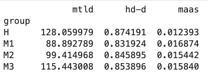

Toutefois, rappelons que la moyenne n’est pas un indicateur très robuste, et bien que ces valeurs semblent confirmer notre hypothèse, celles-ci pourraient être biaisées par quelques valeurs extrêmes (_outliers_). Dès lors, la mesure de la déviation par rapport au groupe de contrôle (telle que présentée dans la section méthodes) est plus informative et statistiquement solide. Les deux graphiques ci-dessous nous montrent les résultats de notre analyse. Les boxplots nous montrent la distribution de l’écart par rapport au groupe de contrôle, pour chaque groupe (ChatGPT niveau 1, 2 et 3). Tant pour l’indicateur MTLD que HD-D, l’on observe une progression, allant du niveau 1 au niveau 3, le niveau 3 étant le plus proche de zéro, à savoir de l’écart nul. Toutefois cette tendance apparait comme relativement timide. 

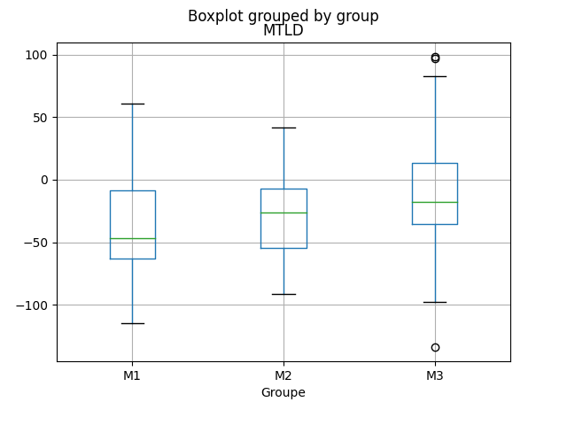
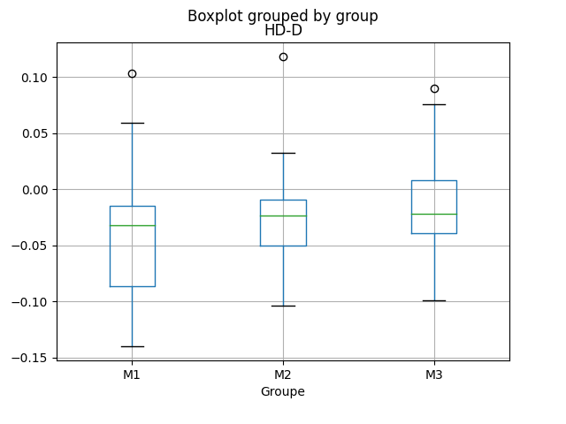

## 2. Analyse qualitative : exemple de poèmes 

Pour nous faire une meilleure idée de la manière dont ChatGPT 3.5 génère des poèmes, nous allons présenter quelques exemples, à savoir, les trois poèmes générés à partir du sonnet d’Arthur Rimbaud, _Le Dormeur du val_, ainsi que les trois poèmes générés à partir du poème de Victor Hugo, _Demain, dès l’aube…_ (voir images ci-dessous). Nous souhaitons ainsi i) comparer les résultats des trois niveaux de prompt, ii) établir les caractéristiques d’écriture de ChatGPT 3.5, ainsi que les différences dans le style des poèmes en fonction de leur niveau de prompt, et iii) déterminer si les scores qu’obtiennent ces poèmes pour les différents indices de diversité lexicale correspondent à notre intuition. 

### Comparaison des niveaux de prompt 

#### Niveau 1  
Le poème de niveau 1 a été généré à partir du prompt : « Écris un sonnet dans le style d’Arthur Rimbaud ». Première constatation, le poème généré ne respecte pas la forme sonnet, mais est constitué de quatre quatrains, avec des rimes alternées, dont plusieurs sont ratées (froissent, flamboie ; insatiable, impossible ; oubliés, défis). Le premier quatrain contient quatre alexandrins, mais cette rigueur rythmique est abandonnée dans la suite du poème. 

Celui-ci est rédigé à la première personne, et le narrateur masculin – qui semble être une imitation du personnage d’Arthur Rimbaud – se présente comme une figure héroïque, presque mégalomane (« je suis prêt à braver l’impossible », « je suis le maître de mon temps », « rien ne peut arrêter l’élan de mon destin »). 

D’une manière générale, le poème est assez faible. Le mot « destin » apparait trois fois, et de nombreux groupes nominaux sont des associations de mots très génériques (« contrées lointaines », « soif insatiable », « passion dévorante », « feu ardent », « victoire triomphante »). Outre les figures de style très pauvres, le propos du poème est lui aussi très peu spécifique (« Je suis prêt à braver l’impossible, Pour conquérir mon destin », etc.). 

Le poème contient également des incohérences sémantiques (« Et je sais que je trouverai sur ma route, tous les défis, Car rien ne peut arrêter … »). Le premier vers « Ô saison, ô châteaux, ô rêves enchantés » est repris en anaphore à la dernière strophe et devient « Ô saison, ô châteaux, ô rêves oubliés ». Ces éléments ne semblent n’avoir rien à voir avec le propos du poème. Il est possible que le terme « saison » soit utilisé en raison du titre de l’œuvre _Une Saison en enfer_ d’Arthur Rimbaud, mais dans le contexte, cela est incohérent. 

#### Niveau 2  
Le poème de niveau 2 a été généré à partir du prompt : « Écris un poème qui ressemble à celui-ci : » suivi des quatorze vers du poème _Le Dormeur du val_. Le poème respecte la forme sonnet, et si la longueur des vers s’approche de la longueur d’alexandrins, elle ne suit pas une rythmique stricte. Les vers ne riment pas. En fait, il apparait que le poème a été généré en performant pour ainsi dire une reformulation du poème original. En effet, les vers ont une forme grammaticale très similaire, mais les noms et adjectifs ont été remplacé par d’autres, issus d’un champ lexical assez similaire. Ainsi « C’est un trou de verdure où chante une rivière, », devient « C’est un coin de ciel bleu où s’égaye une abeille, » ; « où le soleil, de la montagne » devient « où le vent, de la mer » ; « Un soldat jeune » devient « Une enfant joyeuse » ; Ses pieds dans les glaïeuls, il dort, » devient « Ses pieds dans les pâquerettes, elle dort. » ; et le fameux vers final : « Tranquille. Il a deux trous rouges au côté droit. » devient « Apaisée. Elle a deux tresses brunes sur les épaules. ».

Dès lors, le poème a perdu toute cohérence sémantique. On est tour à tour dans le ciel (« C’est un coin de ciel bleu »), vers la mer (« le vent, de la mer »), dans l’herbe (« sa tête blonde sur l’herbe fraîche »), et à l’intérieur (« la main sur son oreiller »). En outre, on retrouve les associations de terme génériques (« herbe fraîche », « doux murmure », « plumes légères », « aventures merveilleuses »). Toutefois, la structure grammaticale du poème original étant largement conservée, celle-ci est plus complexe que pour le poème de niveau 1, contenant notamment des propositions participiales (« Butinant avec ardeur », « Posant sa tête blonde »), des comparaisons (« comme des plumes légères », « Comme un chaton bercé ») et un rejet (« Apaisée. » au vers 14, qui complète le vers 13). 

#### Niveau 3  
Le poème de niveau 3 a été généré à partir du prompt : « Voici des instructions pour écrire un poème : - Commence par « C’est un trou de verdure ou chante une rivière ». - Respecte la forme sonnet. - Décrit un personnage couché dans une nature paisible. - Laisse suggérer que le personnage est mort ». Comme pour le poème de niveau 1, l’output ne respecte pas la forme sonnet, mais est formé de cinq quatrains, avec des rimes embrassées (avec un seul manquement, au vers 8). À nouveau, les vers s’approchent de la longueur d’alexandrins, sans être rythmiquement rigoureux (souvent entre onze et treize syllabes). 

Ici, comme pour les deux poèmes précédents, l’on retrouve le même type d’expressions banales et génériques (« douce nourriture », « fleurs délicates », « le vent murmure », « silence éternel »). Le poème contient également de nombreuses répétitions : le mot « nature », et l’adjectif « éternel(le) » apparaissent trois fois, les mots « silence », « mort » et l’adjectifs « délicat(e) » deux fois, et l’on trouve quatre mots de la même famille que « paix » (« s’apaise », « paix », « apaisement », « paisible »). 

Il a été demandé en prompt de décrire un personnage. Cette requête semble avoir été prise dans un sens trop littéral, comme en témoignent les vers 5 et 13 (« Là, étendu, _un personnage_ repose en paix », « Elle enveloppe _le personnage_ »). De plus, le début de la dernière strophe semble être une explicitation du poème entier (« Dans se sonnet funèbre, la mort laisse sa trace, Mais la beauté de la nature reste éternelle »), réalisant ainsi une mise en abyme assez malvenue. Le poème contient également des incohérences ; il est fait mention de la respiration du personnage (« sa respiration en cadence »), alors que celui-ci est mort. En outre, l’expression « une mélodie empreinte de combes » est nonsensique.

Toutefois, le poème contient quelques éléments intéressants. Au vers 4, il est fait mention de la guerre, alors que cela n’était pas spécifié en prompt. De plus, la comparaison au vers 9 : « Son visage paisible, tel un marbre délicat », est très pertinente pour décrire un mort.

Pour les poèmes générés à partir de _Demain, dès l’aube…_ de Victor Hugo, des considérations analogues à celles faites pour _le Dormeur du val_ s’appliquent, nous serons dès lors plus bref dans notre analyse. Le poème de niveau 1 est tout à fait plat, ne contenant que des images banales, un champ lexical pauvre et une structure grammaticale peu complexe. Il y est à nouveau question de la beauté de la nature, des phénomènes atmosphériques et océaniques (« nuages », « vagues », « vent »). Les mots « vie », « souffle », et « instant » sont répétés deux fois. Le texte contient en outre une répétition incohérente : « las et las », au vers 2. La dernière strophe du poème (« Et je me rappelle […] Que la vie est un souffle […] Et qu’il nous appartient […] De cueillir la beauté […] ») se présente comme une sorte de conclusion, explicitant la « morale » du poème, ce qui semble également être une caractéristique récurrente des poèmes générés par ChatGPT.

Le poème de niveau 2 est à nouveau une reformulation du poème original, mais cette fois-ci, le sens original du poème semble plus étroitement conservé, et c’est plutôt l'ordre des mots qui a été modifié. En témoigne les deux premiers vers : « Demain dès l’aube, à l’heure où blanchit la campagne, Je partirai. Vois-tu, je sais que tu m’attends. » devient « Dès l’aube demain, je partirai, je te l’ai promis, Car je sais que tu m’attends, là-bas, dans l’infini. » ; « J’irai par la forêt, j’irai par la montagne » devient « Je traverserai la ville, je traverserai les champs » ; « Seul, inconnu, le dos courbé, les mains croisées » devient « Marchant seul, inconnu, le cœur lourd et les mains vides ». Toutefois, quelque chose de remarquable se passe à la fin du poème.  Les deux vers finaux de l’original (« Et quand j’arriverai, je mettrai sur ta tombe Un bouquet de houx vert et de bruyère en fleur »), sont transformés de la même manière que les exemples précédents (« Quand j’arriverai enfin, j’irai te rendre hommage, Avec un bouquet de houx vers et de bruyère en fleur ») toutefois le vers est complété par l’ajout de l’expression « comme un message », qui ne fait écho à aucune expression présente dans le poème original. Cette expression semble au contraire amorcer une sorte d’explicitation du sens du poème, confirmée par l’ajout d’une strophe supplémentaire (« Je suis venu te dire que je t’aime encore […] Que même si tu n’es plus là, tu vis en moi à jamais […] ») qui se présente comme un résumé, sous la forme d’une explicitation littérale du poème qui la précède.

Le même genre de considérations s’appliquent pour le poème de niveau 3. Le « sens » du poème original conservé, les phrases sont plus grammaticalement légèrement plus complexes que pour le poème de niveau 1, mais le texte comporte à nouveau de nombreuses répétitions (« fleurs », « tourments », « paix ») ainsi qu’un pléonasme (« voilés par un voile »). La dernière strophe commence par une anaphore faisant écho à la première, phénomène que nous avions déjà observé dans le poème de niveau 1 du _Dormeur du val_, et présent dans de nombreux poèmes générés par ChatGPT.

#### Conclusion : caractéristiques d’écriture de ChatGPT

En somme, l’on parvient, avec cette brève analyse, à dégager plusieurs caractéristiques d’écriture de ChatGPT 3.5 lorsqu’il génère des poèmes. En effet, on repère notamment l’utilisation quasi-exclusive de mots simples et familiers, ainsi que des associations de mots génériques, et la présence de nombreuses répétitions, résultant en un style banal et résolument monotone. En outre, par moment, certaines incohérences sémantiques ou lexicales peuvent apparaitre, trahissant, pour ainsi dire, la machine. Le thème de la nature et de la contemplation de celle-ci est omniprésent, sauf mention explicite du contraire (et encore !), avec des mentions récurrentes de phénomènes atmosphériques, banalement personnifiés (« le vent murmure »). Par ailleurs, on repère également le topos de l’explicitation, la dernière strophe étant presque systématiquement un « résumé » du poème. De plus, lorsque le poème n’est pas prompté pour générer un contenu sémantique particulier, celui-ci est ainsi transformé en une entreprise quasi-pédagogique, trahissant une idée de la poésie comme une sorte de véhicule de leçons de vie banales ; il faut cueillir la beauté de la nature, il faut conquérir son destin coûte que coûte, etc. Dès lors, on assiste pour ainsi dire à une sorte de rabattement de la poésie sur la fable, la contemplation de la nature n’étant plus qu’évoquée que dans le but d’expliquer une leçon morale à en tirer.

# Supplément : Questionnaire 

En guise de supplément à notre analyse de poèmes, nous avons conçu un questionnaire, que nous avons fait passer à une quinzaine de personnes. Nous espérons ainsi enrichir notre analyse et obtenir une idée de l’appréciation générale des poèmes – notamment en fonction des différents niveaux de prompt – en bénéficiant pour ainsi dire d’un « œil externe ». Notons qu’il ne s’agit dès lors pas d’effectuer une analyse quantitative, ou d’établir des mesures basées sur les résultats de ce questionnaire, mais plutôt d’une « prise de la température », qui permettra – nous l’espérons – de motiver une réflexion théorique future.

## Description

Pour préparer le questionnaire, nous avons sélectionné de manière aléatoire 5 poèmes pour chaque niveau de prompt, soit un total de 15 poèmes issus de notre dataset initial (voir section _Données_). Les 15 poèmes sont ensuite présentés dans un ordre aléatoire, mais identique pour chaque participant.e, et pour chacun d’entre eux, les trois choses suivantes sont demandées : 
-	Lisez le poème suivant, et indiquez si vous pensez que celui-ci a été écrit par un humain ou par une machine. (Question à choix multiple : humain/machine)
-	Quels sont les éléments textuels qui ont motivé votre choix ? (Question ouverte)
-	Comment évalueriez-vous la qualité poétique de ce poème ? (Note entre 1 et 5, avec 1 : « Pas intéressant du tout, et 5 : « Émouvant, stimulant »)
Une section supplémentaire a été ajoutée à la fin, pour que les participant.e.s puissent ajouter des commentaires généraux, s’ils ou elles le souhaitent.

### Objectif

La question « humain/machine » est un prétexte. En effet, il ne s’agit pas ici de réaliser un test de Turing, d’autant que les participant.e.s sont d’emblée induit.e.s en erreur du fait que le questionnaire ne contient en réalité aucun poème écrit par un humain. Par ce procédé quasi-rhétorique, nous souhaitons plutôt voir si les poèmes de niveau 2 ou 3 sont plus facilement labellés « humains », ce qui indiquerait que la complexité du prompting joue un rôle dans la « vraisemblance » des textes. En outre, nous sommes particulièrement intéressés à la manière dont le choix « humain/machine » est _justifié_ ; quelles sont les _raisons_ qui mènent les participant.e.s à évaluer un texte comme étant probablement humain ou probablement écrit de manière automatique?

## Résultats 

Première constatation, les résultats sont loin d’être univoques. L’on observe en effet une grande disparité dans les réponses, tant dans l’appréciation de la qualité des poèmes que dans l’attribution de l’auteur – humain ou machine. Outre le fait évident que nous avons trop peu d’échantillons pour observer de véritables _tendances_ statistiques, cette variabilité est probablement due au fait que les évaluateurs.trices répondant au questionnaire ne possédaient presque aucun point de repère. En effet, très peu d’informations ont été données, et aucune sur la provenance des poèmes, leur contexte d’écriture, etc., rendant ainsi l’évaluation très inhabituelle. Ce fait a d’ailleurs été relevé par une personne dans les commentaires généraux : 

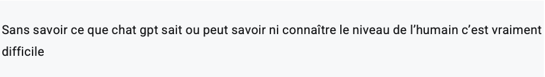

Toutefois, nous allons tout de même brièvement présenter les résultats obtenus dans la section suivante.

### Différences d’évaluation dans les niveaux de prompt

D’une manière générale, les poèmes de niveau 1 sont ceux qui ont globalement été jugés les plus mauvais. Seul un des cinq poèmes a été évalué majoritairement comme étant « humain » (8 personnes sur 13), et c’est dans cette catégorie que l’on trouve le poème avec le taux de réponse « machine » le plus élevé (12 personnes sur 14). Les notes, visant à évaluer la qualité poétique des poèmes sont également les plus basses dans cette catégorie, quatre des cinq poèmes ayant une évaluation modale de 1. De façon assez intéressante, le poème avec la meilleure évaluation de sa catégorie (mode de 3), n’est pas celui qui a majoritairement été évalué comme ayant été écrit par un humain. Nous reviendrons d’ailleurs sur ce point plus tard.

En ce qui concerne les poèmes de niveau 2 et 3, il ne semble pas y avoir de différence tendancielle dans les évaluations ; deux poèmes sur les cinq ont été évalués majoritairement comme étant écrits par un humain dans les deux niveaux. Les deux poèmes ayant le plus haut taux de votes « humain » (12 personnes sur 13, et 11 personnes sur 14) appartiennent tous deux au niveau 3. Cependant, les poèmes de niveau 2 ont des notes de qualité poétiques légèrement meilleures, avec deux poèmes sur les cinq ayant une note modale de 3, contre seulement un pour les poèmes de niveau 3. 

Toutefois, nous nous gardons d’accorder trop d’importance à ces résultats. Car, comme nous l’avons dit plus haut, non seulement notre questionnaire n’a pas été conçu pour faire l’objet d’une analyse statistique, mais notre échantillon de réponses est trop petit et biaisé pour que les résultats de notre questionnaire puissent être considéré comme significatifs de quelque manière que ce soit. 

### Justification 

Nous allons à présent nous intéresser aux justifications données par les répondant.e.s dans la catégorisation des poèmes comme « humains » ou « machines ». En effet, selon nous l’on peut, parmi celle-ci, identifier différents types de justifications, dont nous allons traiter tour à tour.

#### Cohérence, fil conducteur 
L’argument le plus avancé est celui de la cohérence. En effet, presque tous les participant.e.s au questionnaire la mentionnent comme un critère de justification. Un texte incohérent est considéré comme probablement issu d’une machine, alors qu’un texte cohérent est considéré comme probablement issu d’un humain. La justification de la cohérence est donc utilisée dans les deux cas ; lorsque le texte est incohérent mais aussi lorsque le texte est cohérent. Comme on peut le voir dans l’échantillon de réponses suivant. Les premiers sont des arguments avancés pour justifier le vote « machine » :  

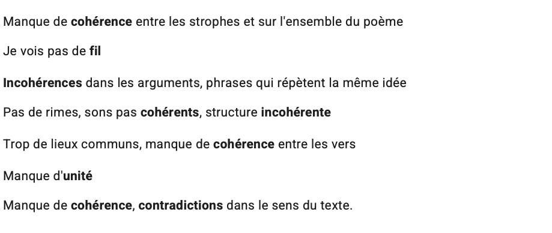

Alors que les suivants sont des arguments avancés pour justifier le vote « humains » :

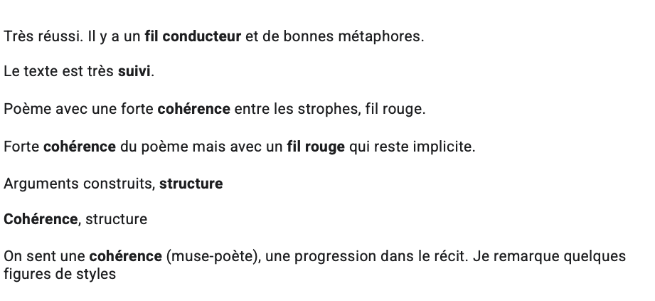

L’on remarque également que la cohérence est considérée sur le plan sémantique comme formel. On mentionne tantôt des « contradictions dans le sens du texte », des « phrases qui répètent la même idée », ou des « arguments construits », une « progression dans le récit », mais également des éléments formels : « structure », « bonnes rimes », etc. En outre, la présence d’éléments nonsensiques dans certains poèmes sert également de justification ; ceux-ci se présentent comme des éléments qui _trahissent_ la machine :

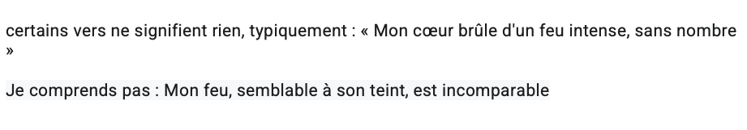

#### Originalité

Le second élément le plus largement cité, est l’originalité. Un poème est donc catégorisé comme probablement car il est (plus) original, et/ou contient des éléments inattendus : 

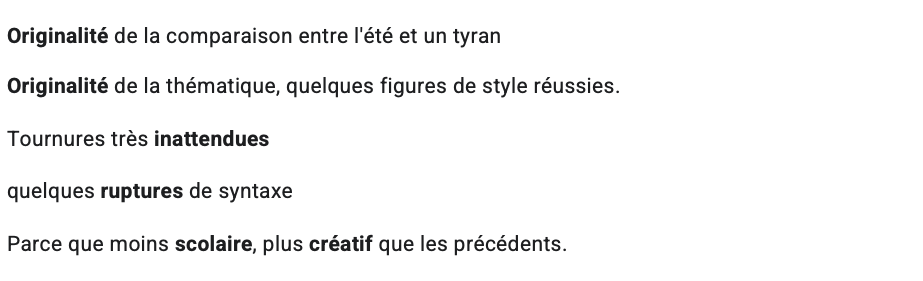

À nouveau, l’on remarque que l’originalité se note tant dans le fond – « originalité de la thématique » – que dans la forme – « ruptures de syntaxes ». À l’inverse, les poèmes qui ne présentent pas d’éléments originaux ou inattendus, jugés « banals » ou pleins de « lieux communs » sont attribués à des machines : 

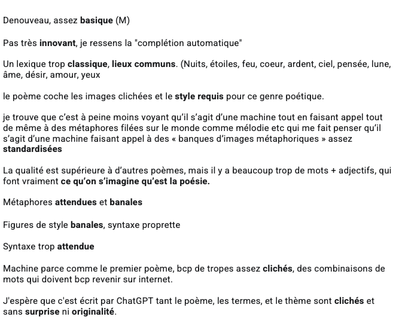

Ainsi, le caractère attendu des poèmes correspond à ce que l’on s’attend à ce qu’une machine soit capable de faire ; un poème simple, reprenant des « des combinaisons de mots qui doivent revenir beaucoup sur internet », résultant en un poème qui correspond à « ce qu’on s’imagine qu’est la poésie », donnant finalement une impression de « complétion automatique ». En effet, l’on s’attend à ce que des métaphores communes soient plus facilement reproductibles, comme le fait remarquer un.e répondant.e à qui certaines figures de style apparaissent comme issues de « banques d’images métaphoriques assez standardisées ». 

Outre ces deux éléments principaux, que sont la cohérence et l’originalité, d’autres types de justifications sont avancés, qui méritent également notre attention.

#### Complexité
Assez similaire à l’argument de l’originalité, l’argument de la complexité est également mentionné. Tant lorsque le poème est trop simple, et donc probablement écrit pas une machine : 

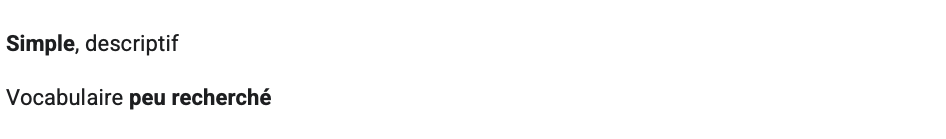

... Que lorsqu’au contraire, celui-ci est considéré comme étant trop complexe pour avoir pu être généré par une machine :

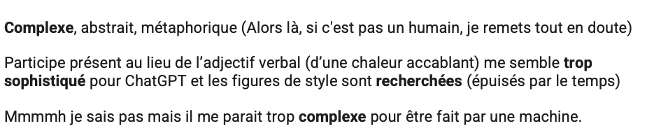

À nouveau les arguments ici trouvent leur origine dans ce que l’on s’imagine qu’un algorithme est capable de produire. Dès lors, un certain niveau de complexité peut apparaitre comme (encore) inaccessible à un modèle de langage comme ChatGPT. Encore une fois, ce qui nous intéresse est bien l’évaluation subjective des participant.e.s, et donc le fait que la complexité soit avancée comme un _critère de discrimination_ entre humain et machine, et non les capacités effectives des algorithmes à atteindre un degré de complexité élevée, mais nous y reviendrons.

De manière intéressante, l’on trouve également le pendant inverse de l’argument de la complexité, à savoir l’argument « trop mauvais pour une machine ». L’on a aussi affaire ici à ce que l’on s’imagine qu’un algorithme est capable de produire, mais dans son versant « optimiste », pour ainsi dire. Ainsi, certains poèmes ont été attribués à un humain car ils contenaient des irrégularités, ou étaient simplement considérés comme trop « mauvais » pour avoir été écrits par un algorithme : 

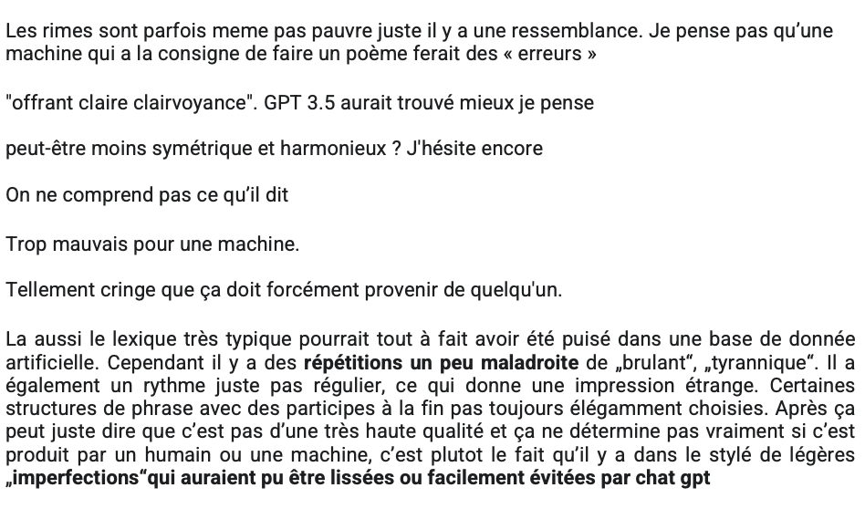

Ainsi, l’on retrouve la même idée que dans l’argument de l’originalité, à savoir que la machine produit un contenu régulier, et lisse ; ce qui a pour conséquence que le contenu est attendu et manque d’originalité, mais le préserve également de faire des erreurs, ou d’être « trop mauvais ».

#### Explicitation

Un autre élément régulièrement avancé pour justifier le choix « machine » est le trope de l’explicitation. En effet, ChatGPT explicite toujours ce qu’il fait ; nous l’avons d’ailleurs relevé dans notre section d’analyse des poèmes générés. Et ce trait semble avoir été repéré de nombreuses fois : 

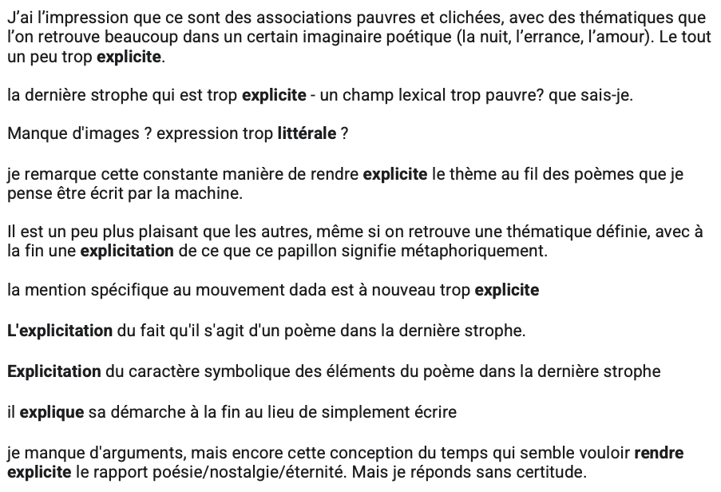

Ainsi, le caractère trop explicite des poèmes, le fait qu’il semble contenir une explication littérale trahit son auteur algorithmique. Toutefois, la raison pour cela n’est pas forcément évidente. Est-ce dû au fait que les personnes ayant répondu au questionnaire connaissent ChatGPT et sont familier.e.s de ses « habitudes » ? Ou est-ce uniquement dû au fait que l’explicitation, dans le cadre de la poésie, n’a pas l’air naturelle ? Car en effet, l’explicitation semble être un trait propre à ChatGPT en particulier – un modèle de langage entrainé principalement pour répondre à des questions et résumer des propos – et ne devrait pas forcément s’appliquer à n’importe quel modèle de langage. Toutefois ici, c’est peut-être aussi le caractère _systématique_ de cette explicitation qui trahit la machine.

####  (Non-)neutralité
Un autre type d’argument, pourraient être regroupés sous l’égide de la « non-neutralité ». En effet, l’on trouve plusieurs commentaires justifiant le choix de l’auteur « humain » par le fait que celui-ci ne semble, pour ainsi dire, pas neutre : 

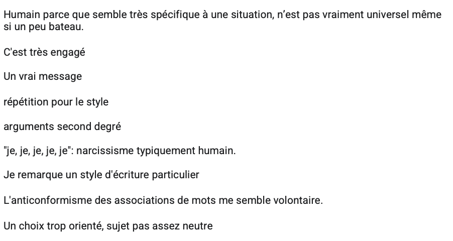

Ici, c’est le caractère non-universel, situé, du poème qui semble déterminant (« n’est pas vraiment universel », « choix trop orienté »), ainsi que l’imputation d’une forme d’agentivité à l’auteur (« semble volontaire », « pour le style »). Ainsi, lorsque l’auteur du poème semble posséder une situation propre et spécifique, lorsqu’il n’apparait pas moralement, ou stylistiquement neutre, cela se présente comme un argument pour lui imputer de l’humanité. En d’autres termes, l’on ne s’attend pas à ce qu’une machine reproduise le discours d’un être situé. À l’inverse, lorsque le texte semble trop neutre, cela peut aussi servir d’argument :

En somme, ces arguments sont issus de la conception que la machine est une instance neutre, au contraire des humains.

#### Beauté 

Finalement, la beauté du poème reste un critère d’évaluation. Soit en ce qu’il est jugé explicitement comme tel – beau, soit parce que les sonorités ou le rythme du poème apparaissent comme travaillés. En témoignent ces commentaires justifiant l’attribution humaine du poème :

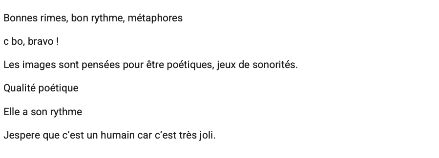

Dans l’autre sens également, lorsqu’un poème est jugé laid, lorsque les phrases ne sonnent pas bien, cela peut servir de justification à l’attribution du poème à une entité artificielle : 

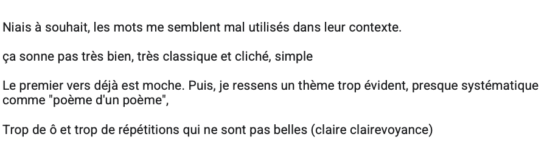

Outre l’appréciation des compétences – ou non – de jugement esthétique chez une machine, l’appel aux sonorités du poème s’explique aussi, du fait que l’on a affaire à un modèle de langage entrainé sur du texte uniquement. Ainsi, l’on observe certaines phrases qui semblent en effet « sonner mal », ou du moins, sonner trop mal pour avoir été écrites par un humain. 

Semblable à la beauté, l’émotivité, ou la capacité du poème à susciter des émotions à quelquefois été mentionnée comme justification : 

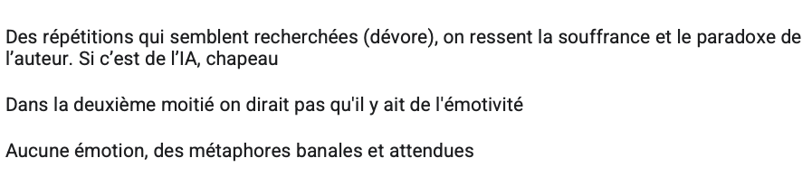

Toutefois, il est intéressant de remarquer que ce type de justification est minoritaire dans notre échantillon de réponses.  Et ceci, quand bien même le « but » de la poésie – si tant est qu’il y en ait un – semble justement de provoquer une réaction émotionnelle. Cela dit, les poèmes étant d’une qualité jugée très faible par quasi tou.te.s les participant.e.s, il est possible que les poèmes – qu’ils soient humains ou artificiels – aient d’office été considérés comme échouant à provoquer des émotions.

#### Humain ou ChatGPT : pas de monopole de la médiocrité

Sur la question de la qualité poétique des poèmes, nous avons mentionné le fait que ceux-ci ont été jugés comme globalement très mauvais par la majorité des participant.e.s. Cette médiocrité n’est toutefois pas jugée comme étant le signe d’un poème écrit par une intelligence artificielle plutôt qu’humaine. En effet, la majorité des répondant.e.s au questionnaire (8 personnes sur 14) ont évalué certains poèmes qu’ils ou elles pensaient écrits par des machines comme étant d’une qualité poétique supérieure à d’autres poèmes qu’ils ou elles pensaient avoir été écrits par des humains. L’idée que la machine ne possède pas le monopole de la médiocrité poétique a d’ailleurs été mentionnée plusieurs fois :

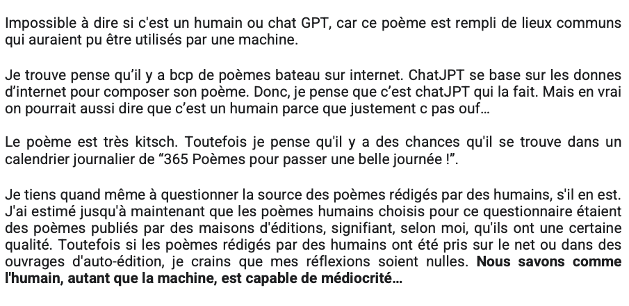

Ainsi, si nous avons vu plus haut que le manque d’originalité, l’utilisation de mots simples et de lieux communs, étaient utilisés comme des critères de justification à l’origine supposément artificielle de poèmes, ces caractéristiques se retrouvent aussi largement dans de nombreuses productions humaines. Comme le suggère le dernier commentaire cité, l’évaluation n’a de sens que si l’on considère que l’on a affaire à de « bons » poèmes humains (des poèmes publiés, d’une certaine qualité), mais si l’on considère les productions humaines dans leur ensemble, alors l’on n’est plus sûr de rien ; car les humains peuvent tout à fait écrire aussi mal, voire plus mal que des machines – comme en témoignent les poèmes jugés « trop mauvais pour une machine » dont nous avons traité plus haut. Dès lors, l’évaluation qualitative est rendue asymétrique : Nous ne sommes pas sûr qu’une IA puisse écrire un bon poème, en revanche, nous sommes certains que les humains sont capables d’en produire de très mauvais !

### Conclusion 

L’analyse des réponses obtenues à notre questionnaire nous a permis de voir que les poèmes de niveau 2 et 3 sont tendanciellement plus facilement qualifiés d’humains que des poèmes de niveau 1 et globalement évalués comme étant d’une qualité supérieure. Toutefois, les poèmes restent tout de même majoritairement considérés comme mauvais et ne « trompent » pas facilement les lecteurs et lectrices, très indécis.e et rarement unanimes quant à l’attribution de l’origine humaine ou artificielle des poèmes. Toutefois, l’analyse des justifications du choix de l’attribution du type d’auteur pour les poèmes s’est révélée plus concluante, révélant des tendances nettes, et des typologies d’arguments confirmant nos intuitions. Nous avons pu voir que la cohérence et l’originalité constituent les deux éléments de discrimination principaux, tant pour justifier l’attribution « humaine » que pour justifier l’attribution « machine ». En outre, nous avons également relevé d’autre types de justifications, moins omniprésents mais tout de même récurrents, à savoir la complexité du poème, le topos de l’explicitation, la non-neutralité du propos, et la qualité esthétique du poème.

Il est intéressant de noter que nombre de ces critères, lorsqu’ils servent de justification à l’attribution humaine du poème, ont été en réalité artificiellement implémentés. Typiquement, les poèmes de niveau 2 ont été généré avec la consigne de copier un poème existant. Or nous avons vu, lors de notre analyse qualitative des poèmes, que ChatGPT se contente souvent de remplacer les termes du poème par des équivalents, tout en conservant la structure grammaticale initiale du poème. Ainsi, ceux-ci apparaissent comme plus originaux au niveau de la forme – car celle-ci a été donnée en prompt. De la même manière les poèmes de niveau 3 sont plus originaux dans le fond, car la thématique du poème et son propos ont cette fois-ci été donnés en prompt. En outre, le caractère non-neutre de certains poèmes, par l’orientation spécifique du sujet, ou l’engagement du propos, qui a pu les disqualifier comment potentiels produits d’une machine, est lui aussi du a des consignes implémentées dans le prompting.  Il possède donc effectivement une origine humaine. 

Finalement, les réponses que nous avons obtenues à ce questionnaire, nous ont permis de confirmer certaines de nos intuitions. En effet, les prompts plus complexes améliorent la qualité des poèmes mais ceux-ci restent tout de même trop standardisés, et pas assez variés. Ceux-ci sont également victime d’une explicitation systématique, qui semble être le propre de ChatGPT. Ainsi, les poèmes apparaissent comme sensiblement moins variés que des productions humaines, le manque d’originalité et la récurrence des thématiques abordées étant systématiquement pointées.

